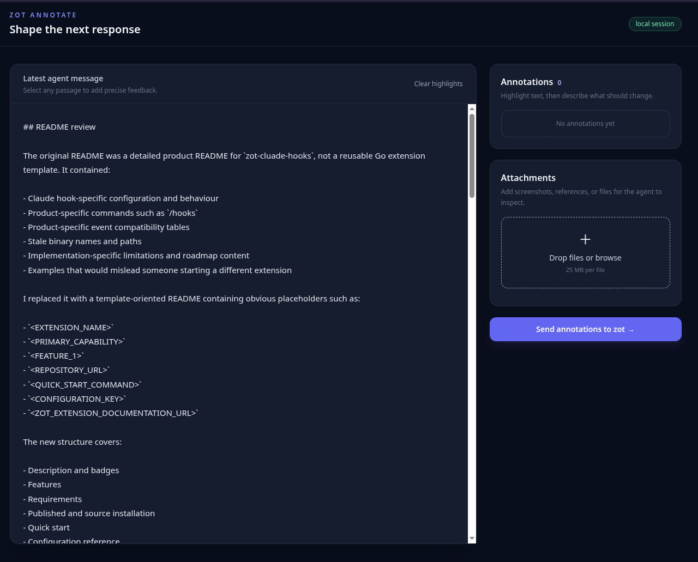
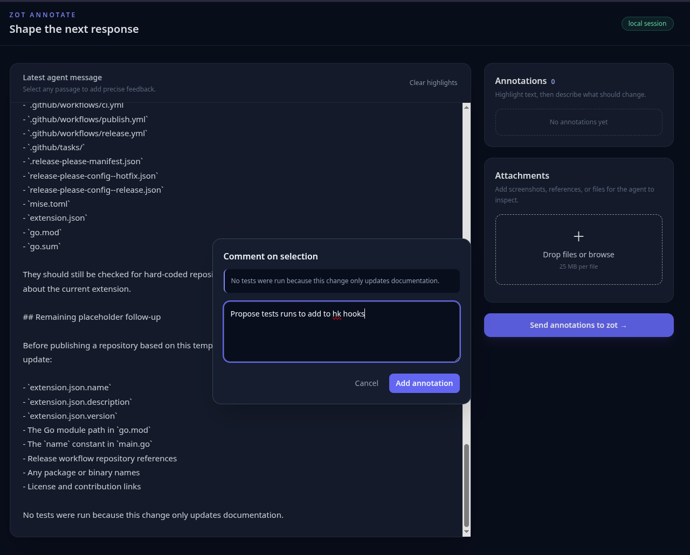
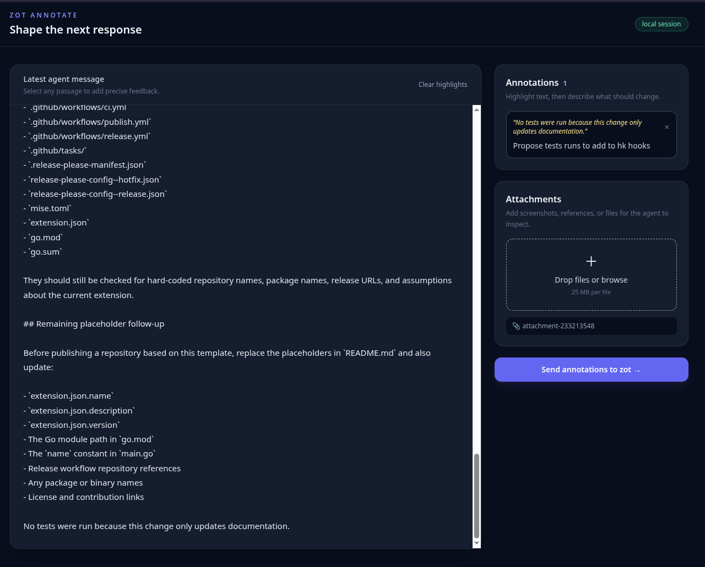

# zot-annotate

`zot-annotate` adds `/annotate`, a browser-based review surface for the latest
agent message. It is based on the `zot-extension-template-golang` layout and
uses only the Go standard library.

## UX proposal

1. **Start in the TUI.** After an assistant response, run `/annotate`.
2. **Move to the browser intentionally.** zot-annotate starts a loopback HTTP
   server on an automatically selected free port and opens the URL with the
   platform browser. The TUI immediately shows that the annotation session is
   ready; it never blocks the agent turn.
3. **Review the response.** The left pane presents the latest response in a
   readable, scrollable document. The right rail contains the review state.
4. **Annotate in place.** Select text with the mouse. A focused comment dialog
   records the exact selected text and a requested change. Multiple annotations
   can be added, edited by deleting/re-adding, and cleared before submission.
5. **Attach context.** Drag files, screenshots, or images into the attachment
   drop zone. Files are stored in the extension data directory and their local
   paths are included in the follow-up so the agent can inspect them with its
   normal tools.
6. **Submit once.** The browser posts each annotation immediately to the
   extension API. They remain pending until the browser submits them or you
   run `/annotate collect`. zot-annotate sends a follow-up prompt through the
   extension protocol, preserving the original message, annotations, and
   attachment paths. The agent can then produce a revised response in the
   normal TUI.

The annotation command also supports:

- `/annotate sync` — include new assistant messages produced since the current
  annotation session started. The browser picks these up automatically.
- `/annotate collect` — send all annotations currently pending in the session
  to the agent without closing the browser session.
- `/annotate cancel` — close the annotation UI and discard all pending
  annotations.

This first slice deliberately uses a compact feedback package rather than
trying to mutate the transcript. That keeps session history intact and makes
annotation requests auditable.

## Screenshots

### Initial launch



### Annotating a selection



### Attaching an image



## Install and run

```sh
go build -o zot-annotate .
zot ext install .
# restart zot, wait for an agent response, then run /annotate
```

For development:

```sh
zot --ext .
```

The embedded UI is served from `ui/index.html`; there is no separate frontend
build step.

## Configuration

Configuration is read from `config.json` in the extension's `data_dir`:

```json
{"host":"127.0.0.1"}
```

Supported hosts are:

- `127.0.0.1` (default): local browser only.
- `localhost`: local browser only.
- `0.0.0.0`: listen on all interfaces. Use only on a trusted network; the UI
  has no authentication and can expose the latest agent message and uploaded
  files to anyone who can reach the port.

`ZOT_ANNOTATE_HOST` overrides the file setting for a single run. The port is
always selected by the operating system, so multiple zot sessions do not need
hard-coded port assignments.

## Zot theme integration

The annotation UI uses the same terminal-style visual language as zot.sh and
loads the user's active theme when available. It checks the selected theme
from Zot's `$ZOT_HOME/config.json` and loads the matching file from
`$ZOT_HOME/themes/`, including xterm-256 color values and RGB color objects.

For an explicit theme file, set:

```sh
export ZOT_ANNOTATE_THEME_FILE="$ZOT_HOME/themes/my-theme.json"
```

The UI maps the theme's `background`, `fg`, `muted`, `accent`, `assistant`,
`tool`, and `error` colors to local CSS variables. Missing values fall back to
the built-in cyan/slate palette. This keeps the extension usable with older
Zot hosts while allowing the web surface to follow the user's current Zot
colors.

## Security and lifecycle notes

- The extension has the same filesystem permissions as zot.
- Uploaded files are limited to 25 MiB each and saved with restrictive
  directory permissions under `data_dir/annotations`.
- The server starts only after `/annotate` is invoked and remains available for
  the lifetime of the extension process. Binding is loopback by default.
- The UI currently loads Tailwind's browser CDN script for styling. The HTML
  and behavior are embedded; a production packaging pass should vendor a
  compiled Tailwind stylesheet if offline use is required.
- Headless zot modes cannot open a browser and are not a supported UX target.
